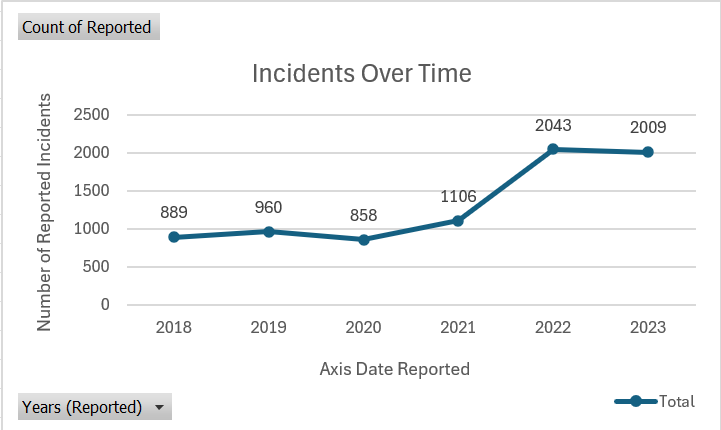
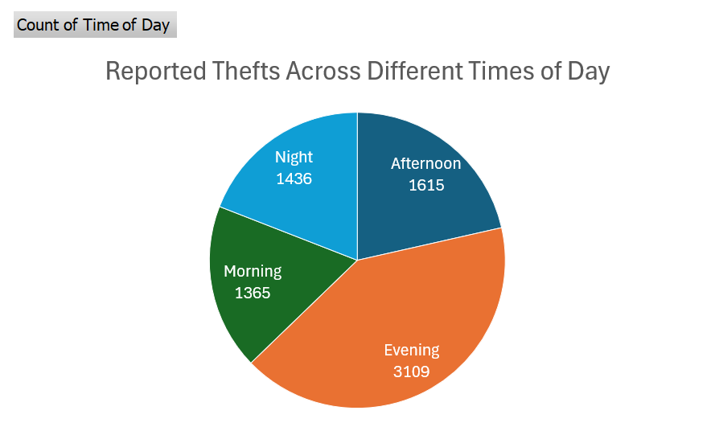
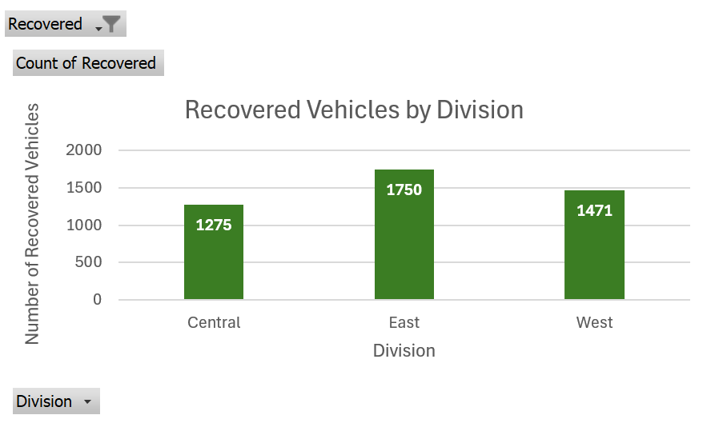

# Ottawa Police Car Theft Visualization Project

## 📌 Project Overview

This project analyzes **Ottawa Police Service (OPS) open data** on vehicle thefts and presents the findings through three key visualizations.  

The goal was to apply best practices in **data visualization** (titles, labels, color, clarity) to turn raw data into clear and compelling insights, using **Microsoft Excel** for analysis and visualization.

---

## 📊 Visualizations

### 1. Line Chart – Incidents Over Time (2018–2023)
Shows the trend of reported vehicle thefts in Ottawa.  
**Key Insight:** Car thefts dipped in 2020 but rose sharply, peaking in 2022 with **2,043 incidents**.  

---

### 2. Pie Chart – Reported Thefts by Time of Day
Distribution of thefts across morning, afternoon, evening, and night.  
**Key Insight:** The **Evening** accounted for the largest share of vehicle thefts.  

---

### 3. Bar Chart – Recovered Vehicles by Division
Comparison of recovered vehicles across OPS divisions (Central, East, West).  
**Key Insight:** The **East Division** recovered the most vehicles, followed by West, then Central.  

---

---

## 📑 Reports
- [Project Report](reports/Data_Visualization_on_Ottawa_Police_Car_Theft.pdf)  

These documents explain the step-by-step chart improvements and reasoning behind visualization choices.

---

## 📈 Dataset
- **Files:** `OPS_Divisions_Open_Data.csv`, `OPS_Divisions_Open_Data_2.csv`  
- **Source:** Ottawa Police Service Open Data Portal  
  - [Auto Theft Dashboard](https://data.ottawapolice.ca/pages/auto-theft)  
  - [Auto Theft Dataset](https://data.ottawapolice.ca/datasets/e5453a203e2a4baeac32ac4e70ce852c_0/about)

---

## 🛠️ Tools Used
- **Excel** → Primary visualization tool  
- **Microsoft Word & PDF** → Report preparation  
- **Dataset** → Ottawa Police Service Open Data  

---

## 📌 Key Learnings
- Importance of **chart titles, axis labels, and clear legends** for readability  
- How small improvements (colors, data labels, markers) make a big difference in communication  
- Applied best practices to turn raw numbers into clear, actionable insights  

---

## 📜 License
This project is released under the **MIT License** — free to use, share, and adapt with attribution.

---
